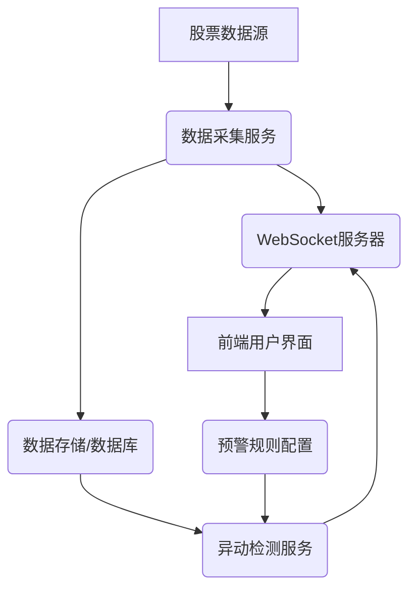

## 技术架构设计与数据源调研

### 1. 系统架构

**整体架构图:**

**模块说明:**

*   **股票数据源**: 提供实时股票行情数据，可能通过WebSocket或RESTful API。
*   **数据采集服务**: 负责从数据源获取原始股票数据，进行初步清洗和格式化。
*   **WebSocket服务器**: 核心组件，负责与前端建立实时连接，接收前端请求，并向前端推送实时行情和预警信息。
*   **数据存储/数据库**: 存储历史股票数据、用户预警规则和预警记录。可选用时序数据库（如InfluxDB）存储行情数据，关系型数据库（如PostgreSQL）存储用户配置。
*   **异动检测服务**: 独立的服务模块，从数据存储中获取数据，运行异动检测算法，并将检测到的异动信息发送给WebSocket服务器。
*   **前端用户界面**: 展示实时行情、预警信息，并提供预警规则配置功能。
*   **预警规则配置**: 用户通过前端界面配置预警规则，规则存储在数据库中。

### 2. 技术选型

*   **后端语言**: Python (易于数据处理和算法实现)
*   **WebSocket框架**: `websockets` (Python库，轻量级、高性能)
*   **数据存储**: 
    *   实时行情数据: InfluxDB (时序数据库，适合存储大量时间序列数据)
    *   用户配置/预警记录: PostgreSQL (关系型数据库，数据结构化)
*   **数据处理/异动检测**: Pandas, NumPy (Python库，用于数据分析和算法实现)
*   **前端框架**: React/Vue.js (构建交互式用户界面)
*   **图表库**: ECharts/Plotly (用于数据可视化)

### 3. 数据源调研

根据初步搜索结果，以下是一些潜在的实时股票数据API和WebSocket接口：

*   **Tushare Pro**: 提供丰富的股票历史和实时数据，但实时数据可能需要积分或付费。
*   **Futu API (富途开放API)**: 提供实时行情接口，可能需要开通富途账户并满足一定条件。
*   **AKShare**: 开源的财经数据接口库，支持获取A股数据，但实时性可能需要进一步验证。
*   **Gugudata**: 提供A股实时交易数据查询API，毫秒级查询性能。
*   **jvQuant**: 提供沪深Level2行情WebSocket接口，支持实时行情推送，速度快。
*   **Alpha Vantage**: 提供免费的历史和实时数据API，但有请求频率限制，可能不适合高频实时数据。
*   **zhangxiangliang/stock-api**: GitHub上的开源项目，可作为参考。

**初步选择**: 考虑到实时性和WebSocket支持，`jvQuant` 看起来是一个有潜力的选择，需要进一步研究其API文档和接入方式。如果免费API无法满足实时性要求，可能需要考虑付费数据源或通过爬虫获取（但爬虫存在法律和稳定性风险）。

**下一步**: 详细研究选定的数据源的API文档，了解数据格式、请求限制和认证方式，并尝试进行数据接入测试。

